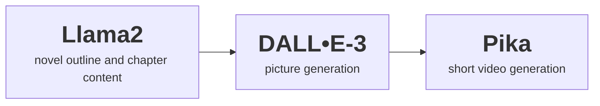

# novel-generation

### Project for Penn GenAI Hackathon by Yufa Zhou and Hao Feng.

Pipeline: 

Description: 

We utilize Llama2-7b-chat hosted on our local server and engage in prompt engineering to craft engaging novels. 

First, we develop character biographies and plot scripts. This part is defined by the user.

Next, we incorporate these elements into the prompt and ask the model to outline the novel. Then, we ask the model to elaborate on each chapter, compiling the results.

Lastly, we use DALL•E-3 to create pictures for each chapter based on Llama2's prompts. These pictures are then fed into Pika to produce short, 3-second videos.

